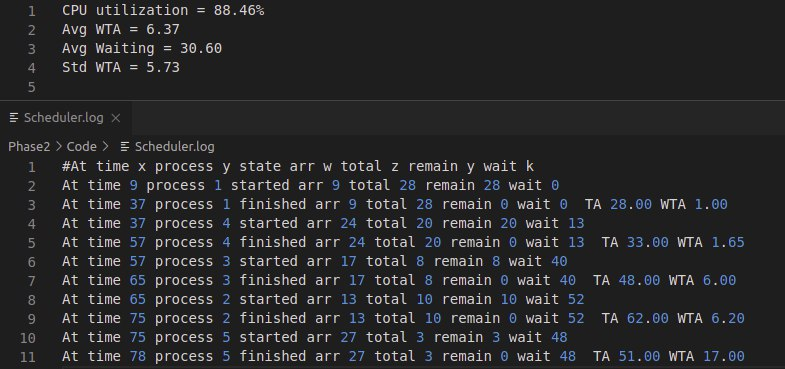

# Sim-OS
## About
Simulation of an OS scheduler and memory manager using different scheduling algorithms including non-preemptive Highest Priority First, Shortest Remaining Time Next, and Round Robin.

## Algorithm Flow
1. Recieve all processes which come in the current second

2. Based on the chosen Algo, the scheduler decides whether the current processshould be preempted or continue running

3. Forking a new process:
	* Try allocating memory block to the process:
		* Allocated: fork and push it in the ready queue
		* No suitable memory block: push it in the waiting queue and go for another process

4. Preemption:
	*  check if the waiting queue is empty
		* True: pop a process from the ready queue based on the algorithm
		* False: pop a suitable process to the free memory size

5. check if the current process has finished
	* True: free its memory block and pop a new process
	* False: continue running or preempt it based on the algorithm criteria
	
	
## Results
1. HPF Algorithm
	

	

  

2. SRTN Algorithm
	

	

3. Round Robin Algorithm
	

	

        

